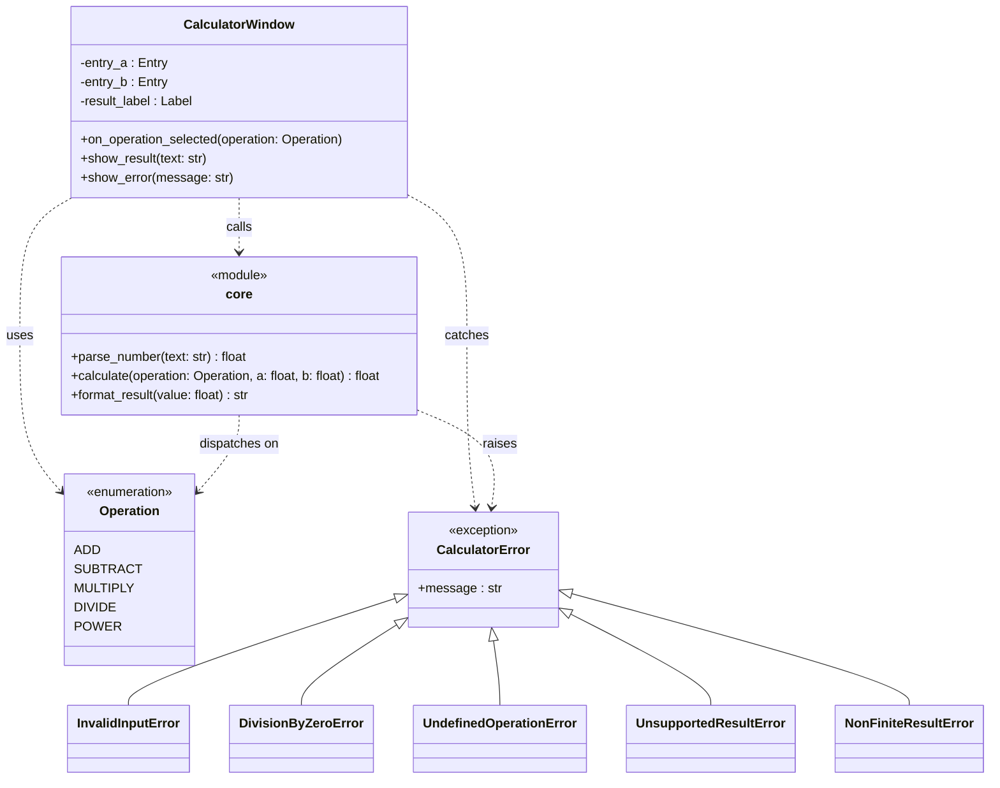

# Class diagram: Calculator

See `design.md` for full context. All elements below are **proposed** — this is a new project with no existing code.

## Existing elements

None. This is the project's first feature.

## Proposed elements

- `CalculatorWindow` (class): the Tkinter window. Modeled as a class because it must hold widget state (`entry_a`, `entry_b`, `result_label`) across button-click callbacks.
- `core` (module, shown with `<<module>>` stereotype rather than as a class): `parse_number`, `calculate`, and `format_result` are stateless, UI-independent functions. They are grouped here as a module rather than a class because there is no identity or lifecycle to encapsulate — a `Calculator` object would own no state and add nothing over plain functions.
- `Operation` (enum): the five supported operations (R1–R5).
- `CalculatorError` hierarchy (classes): `CalculatorError` is the common base; `InvalidInputError`, `DivisionByZeroError`, `UndefinedOperationError`, `UnsupportedResultError`, and `NonFiniteResultError` are real subtypes so `CalculatorWindow` can catch broadly (never crash) while still branching on the specific subclass to choose a message (R6).

## Why these relationships are needed

- `CalculatorWindow ..> core`: the window only ever calls into calculation logic, never the reverse — this keeps `core` testable and displayable without a window.
- `CalculatorWindow ..> CalculatorError`: the window must catch every calculator failure without crashing (R6, "Access and failure behaviour"); a single shared base class makes that a one-line `except CalculatorError`.
- `core ..> CalculatorError`: `core.calculate` is the only place these errors are raised, keeping error-producing conditions (R4's divide-by-zero, R5's Power edge cases, R6's non-finite-result rule) in one UI-independent place.
